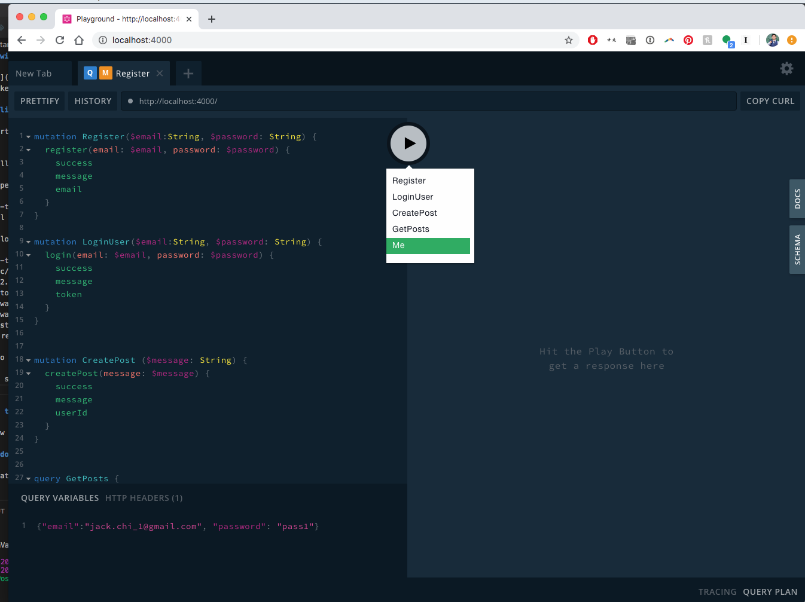

# Sample Twitter Example

An [Apollo](https://github.com/apollographql/apollo-server) GraphQL backend server for a minimal twitter-like GraphQL API. 

### Installing

To get started with `graphql-twitter-example`:

```
brew install node
```
Install dependencies:
```
cd graphql-twitter-example
npm install
``` 
Start apollo server:
```
cd graphql-twitter-example
nodemon src/index.js
[nodemon] 2.0.3
[nodemon] to restart at any time, enter `rs`
[nodemon] watching path(s): *.*
[nodemon] watching extensions: js,mjs,json
[nodemon] starting `node src/index.js`
🚀 Server ready at http://localhost:4000/
```
Navicate to localhost:4000

You should see:


#### Optional Seeding / Mutation

[sequelize-cli](https://sequelize.org/master/manual/migrations.html) is installed for extensibility of future schema changes.

Let's say future you want to add a profile picture first,last names.
```
npx sequelize-cli model:generate --name User --attributes firstName:string,lastName:string,email:string,password:string
```

To seed db, populate the db with some accounts for testing:

```
npx sequelize-cli db:seed:all
```

## APIs

### Mutations
register - registers a email/password if it doesn't exist
```
mutation Register($email:String, $password: String) {
  register(email: $email, password: $password) {
    success
    message
    email
  }
}
```
If successful:
```
{
  "data": {
    "register": {
      "success": true,
      "message": "User Created",
      "email": "jack.chi_3@gmail.com"
    }
  }
}
```
If email is already registered:
```
{
  "data": {
    "register": {
      "success": false,
      "message": "Email already taken.",
      "email": "jack.chi_1@gmail.com"
    }
  }
}
```

login - logs in the user via email/password

```
mutation LoginUser($email:String, $password: String) {
  login(email: $email, password: $password) {
    success
    message
    token
  }
}
```

If successful login, an Authorization Token will be returned.
```
{
  "data": {
    "login": {
      "success": true,
      "message": "Logged in!",
      "token": "$2b$10$vBm4xcoUn5gReSDKLrWQIeBiy.8sin2ROiLKL6TPvtF0N8Jo3brkG"
    }
  }
}
```

Then use the Authorization token on HTTP request headers:
```
{
  "authorization": "$2b$10$vBm4xcoUn5gReSDKLrWQIeBiy.8sin2ROiLKL6TPvtF0N8Jo3brkG"
}
```

createPost - creates a post from a String message

```
mutation CreatePost ($message: String) {
  createPost(message: $message) {
    success
    message
    userId
  }
}
```
Notice how we didn't need to provide the email/password again.
```
{
  "data": {
    "createPost": {
      "success": true,
      "message": "Cash Point Card is awesome!",
      "userId": "5"
    }
  }
}
```

### Query
me - gets the logged in user
```
query Me {
 me {
  	id
  	email
  	posts {
      message
    }
	} 
}
```
response:
```
{
  "data": {
    "me": {
      "id": "5",
      "email": "jack.chi_3@gmail.com",
      "posts": null
    }
  }
}
```

posts
```
query GetPosts {
  posts {
    count
    posts {
      id
      userId
      message
      createdAt
    }
  }
}
```
response contains total count and the message with created at datestring
```
{
  "data": {
    "posts": {
      "count": 1,
      "posts": [
        {
          "id": "13",
          "userId": "5",
          "message": "Cash Point Card is awesome!",
          "createdAt": "5/3/2020, 9:35:57 AM"
        }
      ]
    }
  }
}
```

## Further Explanations

### PROS
- Currently using a sequelize for database orm. The datasource can be easily swapped out for mariadb/sql/etc. 
- Choice of using Apollo GraphQL server can be federated across services.
- Simplicity!

### CONS
- Account authentication security. Initially I experimented with [accountjs-accounts/accounts](https://github.com/accounts-js/accounts) but had issues with fragment inline types. I tried to extend the schema type `User` but it was too rigid to define @relations. This definitely needs to be fixed. Perhaps with Firebase REST datasource. 


## Acknowledgments
* Initially inspired by Point Card coding challenge

